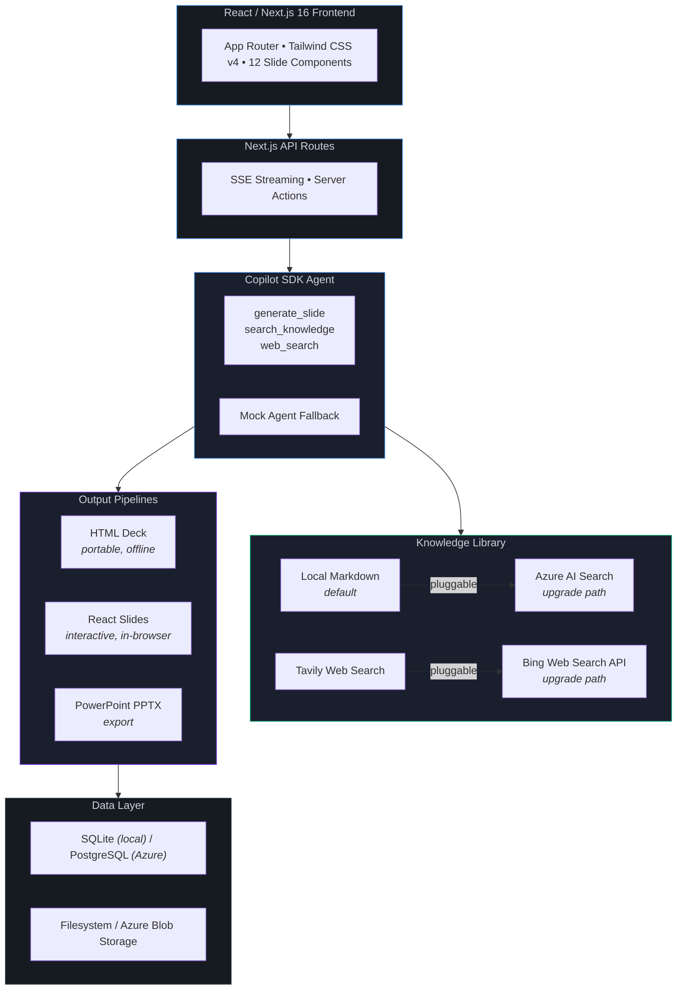

# Architecture — Presentation Ninja

## Primary Goal

**Get anyone from `git clone` to a stunning AI-generated presentation in under 3 minutes.**

Every architectural decision in this project is measured against that goal. No Azure subscription required. No vector database to provision. No Docker image to build. Just `npm install`, set one environment variable, and run. The entire solution runs locally on a single machine — a developer with Node.js and a GitHub Copilot subscription can clone the repo and generate their first presentation before their coffee gets cold.

This goal drives our choices: local Markdown over a vector store, Tavily over Azure Bing Search, SQLite over PostgreSQL, and a bundled Copilot CLI over a separately installed runtime. Complexity is always available as an upgrade path (Azure AI Search, Azure App Service, PostgreSQL) — but the default experience is **instant and frictionless**.

## High-Level Architecture

```
┌───────────────────────────────────────┐
│   React / Next.js 16 Frontend         │
│   (App Router, Tailwind CSS v4)       │
│   Slide React Components              │
├───────────────────────────────────────┤
│   Next.js API Routes                  │
│   (SSE Streaming, Server Actions)     │
├──────────┬───────────┬────────────────┤
│ Copilot  │ Knowledge │  Output        │
│ SDK      │ Library   │  Pipelines     │
│ Agent    │ (Local    │  ├ HTML Deck   │
│          │  Markdown │  ├ React Slides│
│          │  + Tavily │  └ PPTX Export │
│          │  Web      │                │
│          │  Search)  │                │
├──────────┴───────────┴────────────────┤
│   SQLite (local) / PostgreSQL         │
│   Filesystem / Azure Blob             │
└───────────────────────────────────────┘
```



## Technology Stack Rationale

### Why Node.js / TypeScript?

The GitHub Copilot SDK is available in **four official languages** — Node.js, Python, Go, and .NET — plus community-maintained SDKs for Java, Rust, Clojure, and C++. We chose Node.js/TypeScript because it gives us a **single language across the entire stack** — from the AI agent to the API layer to the slide rendering UI — with no context switching and no inter-process communication between backend and frontend.

| Choice | Why |
|--------|-----|
| **Node.js + TypeScript** | The Copilot SDK agent, the API routes, and the React slide components all share the same language and type system. A `SlidePlan` type defined once is used in the agent's `generate_slide` tool, the SSE streaming API, and the React slide renderer — no serialization boundaries, no duplicate schema definitions. |
| **Next.js 16 (App Router)** | Unified frontend + backend in one project. API routes handle SSE streaming for real-time generation progress. Server components reduce client bundle size. The App Router's layout system enables persistent generation state across page navigations. |
| **React 19** | The presentation viewer renders slides as React components — each of the 12 layout types is a standalone component with Tailwind CSS styling. React's component model is a natural fit for composable slide templates. |
| **Tailwind CSS v4** | Utility-first CSS keeps slide styling co-located with slide markup. No separate stylesheet to maintain per layout. Themes are expressed as CSS variable overrides, not duplicate stylesheets. |
| **SQLite** | Zero-config local database — no server to install, no connection string to configure. Ships as a single file. For Azure deployment, the app supports PostgreSQL as a drop-in replacement. |

**Why not Python, Go, or .NET?**

Any of these could power the agent backend. But this application isn't just an agent — it's an agent **plus** a rich interactive UI with 12 slide layout components, drag-to-reorder topic management, real-time SSE streaming, and a custom HTML rendering pipeline. With Node.js, the agent and the UI live in the same process, share the same types, and deploy as a single unit. A Python or .NET backend would require a separate frontend project, an API contract between them, and two deployment targets — adding complexity that conflicts with our primary goal of getting anyone running in under 3 minutes.

## Key Components

### AI Agent (GitHub Copilot SDK)
- Topic-scoped agent with pre-loaded knowledge about Microsoft Foundry, Copilot CLI, Copilot, and Copilot SDK
- Custom tools: `search_knowledge`, `web_search` (Tavily), `generate_slide`
- Streaming SSE events from API to frontend for real-time progress
- Automatic fallback to mock agent when SDK auth is not configured

### Slide Rendering & Output Formats

The application produces presentations in multiple output formats:

#### React Slides Mode
- Slides rendered as React components with Tailwind CSS
- 12 layout types: Title, Content, Split, Code, Stat, Comparison, Timeline, Quote, Bento, Chart, YouTube, Demo
- 5 themes: Dark Luxe, Tech Gradient, Clean Corporate, Bold Statement, Warm Minimal
- Browser presentation mode (fullscreen)
- Export to PowerPoint (PPTX) for offline sharing and corporate use

#### HTML Presentation Mode
- Generates a **standalone, self-contained HTML file** — a complete presentation in a single `.html` document
- All CSS, animations, and slide content are embedded inline — no external dependencies
- 4 themes: Cyan Violet, Emerald Cyan, Amber Rose, Slate Blue
- Keyboard navigation (arrow keys, spacebar), fullscreen presenter mode
- **Fully portable** — works offline, can be emailed, hosted on any static server, or opened directly in a browser
- The HTML pipeline (`slide-to-html.ts`) converts each `SlidePlan` into styled HTML with CSS animations, then wraps all slides into a single-page app with navigation controls

#### PowerPoint (PPTX) Export
- React Slides can be exported to `.pptx` format for use in Microsoft PowerPoint, Google Slides, or Keynote
- Enables presenters to further customize slides in familiar tools after AI generation

### Precanned Slides
- **Demo Slides**: Bold, attention-grabbing template injected without AI generation
- **YouTube Slides**: Embedded video player with auto-extracted video ID
- Precanned slides are merged with AI-generated slides based on user-defined topic ordering

### Topic Management
- Drag-to-reorder topics using @dnd-kit
- AI topic generation via Copilot SDK suggest-topics endpoint
- Mixed content: AI topics + Demo slides + YouTube slides in any order

### Knowledge Library & AI Web Search

The Knowledge Library is a curated set of Markdown files (one per topic) stored locally in `src/data/`. It serves as the agent's primary source of truth for generating accurate, domain-specific slide content.

**Why local Markdown files instead of a vector store?**

We intentionally chose flat Markdown files over a vector database (e.g., Azure AI Search, Pinecone, ChromaDB) for the knowledge layer. The reasoning:

1. **Simplicity** — The app runs locally with `npm install && npm run dev`. No external vector database to provision, no embedding model to configure, no indexing pipeline to maintain. This keeps the barrier to entry as low as possible.
2. **Deterministic retrieval** — With only four well-defined topics, full-text keyword search over a handful of Markdown files is fast, predictable, and easy to debug. Vector similarity search adds value when you have thousands of documents and need semantic matching — here, it would be over-engineering.
3. **Zero cost** — No Azure AI Search resource, no embedding API calls, no storage costs. The entire knowledge layer ships with the repo and works offline.
4. **Transparency** — Contributors can read, edit, and review knowledge packs in plain Markdown. No opaque embeddings to inspect or re-index when content changes.

**Where Azure AI Search fits in:**

For production or enterprise deployments with a larger, evolving knowledge corpus, Azure AI Search is the natural upgrade path:

- Replace the local `search_knowledge` tool with an Azure AI Search index query
- Use Azure OpenAI embeddings to vectorize knowledge documents for semantic retrieval
- Enable hybrid search (keyword + vector) for higher recall on nuanced queries
- Leverage built-in features like semantic ranking, faceted filtering, and scheduled indexers to keep the knowledge base current
- This swap is isolated to the `search_knowledge` tool implementation — the rest of the agent, pipeline, and UI remain unchanged

The architecture is designed so that the knowledge retrieval layer is **pluggable**: swap the local file reader for an Azure AI Search client and the agent works the same way, just with a richer, more scalable knowledge store.

**AI Web Search pattern (Tavily integration):**

Regardless of whether the knowledge store is local Markdown or Azure AI Search, the agent also uses **live web search** during generation:

- The agent's `web_search` tool calls the Tavily Search API to retrieve **real-time, up-to-date information** from the web
- Search results **ground and supplement** the knowledge library — ensuring slides reflect the latest product updates, announcements, and statistics
- This pattern keeps the knowledge base current without manual curation: the local files (or vector index) provide a stable foundation, while Tavily web search fills in recent developments and verifies facts
- Example flow: the agent reads the local knowledge pack for "GitHub Copilot SDK", then uses `web_search` to find the latest SDK release notes and new API features, and combines both sources into accurate slide content

**Why Tavily over Azure or Bing web search?**

We chose Tavily Search for the same reason we chose local Markdown files for knowledge: **simplicity and zero Azure dependency**.

| Criteria | Tavily | Bing Web Search (Azure) | Azure AI Search (web crawl) |
|----------|--------|------------------------|-----------------------------|
| **Setup** | Sign up at tavily.com, get an API key, set one env var | Create an Azure Cognitive Services resource, accept marketplace terms, configure resource group, get subscription key | Create Azure AI Search resource + indexer + data source + skillset, configure web crawl schedule |
| **Azure resources needed** | None | Azure Cognitive Services (Bing Search v7) resource | Azure AI Search + Azure OpenAI (for embeddings) + Azure Blob (for crawl cache) |
| **Cost model** | Free tier (1,000 searches/month), then pay-per-query | Pay-per-query ($3–$7 per 1,000 calls depending on tier) | Monthly resource cost ($249+/month for Basic tier) + Azure OpenAI embedding costs |
| **Time to integrate** | 5 minutes — single REST call, JSON response with extracted content | 30 minutes — REST call, but response is raw web results (snippets only, no content extraction), requires additional parsing | Hours to days — provision resources, define index schema, configure indexer, build embedding pipeline |
| **Response quality** | Returns **extracted, clean content** from web pages — not just snippets. Optimized for AI/LLM consumption. | Returns search result snippets (titles + short descriptions). Getting full page content requires a second fetch + HTML parsing step. | Returns indexed content — high quality but only from pre-crawled sources, not real-time web |
| **Works offline/locally** | Yes (with API key) — no Azure subscription needed | No — requires active Azure subscription | No — requires multiple running Azure resources |

**The key tradeoff:** Tavily is purpose-built for AI agents — it returns clean, extracted page content in a single API call, ready to feed into an LLM prompt. Bing Web Search returns traditional search snippets, which means you need an extra step to fetch and parse full page content before the agent can use it. Azure AI Search with web crawling is the most powerful option but requires significant Azure infrastructure.

**Switching to Azure-based web search:**

The `web_search` tool is a single function in the agent's tool definitions. To switch to an Azure alternative:

- **Bing Web Search API**: Replace the Tavily REST call with a Bing Search v7 call. You'll need to add a content extraction step (fetch the top result URLs and parse the HTML) since Bing only returns snippets. Requires an Azure Cognitive Services resource with Bing Search enabled.
- **Azure AI Search with web crawl indexer**: Replace the real-time web search with an index query against pre-crawled web content. Better for scenarios where you want to control exactly which sources are searched, but results won't be as fresh as real-time search. Requires Azure AI Search (Basic tier or higher), an indexer with a web crawl data source, and an embedding model for vector search.

Like the knowledge store, the web search layer is **pluggable** — the agent calls a `web_search` tool, and the implementation behind that tool can be swapped without changing the agent, pipeline, or UI.

### Data Layer
- SQLite (local default) for user data and presentation metadata
- Curated knowledge library (Markdown files per topic) — see Knowledge Library section above
- Presentations tracked with status: generating → completed / failed

### Generation State Management
- React Context (`GenerationProvider`) tracks cross-route generation state
- DB record created at generation start with `status: 'generating'`
- Dashboard shows in-progress generations in real-time
- Navigation away doesn't lose generation progress

## Authentication
- NextAuth.js v5 with credentials provider
- Demo account: demo@deckforge.local / demo1234
- JWT-based sessions
- Middleware protects all app routes

## Azure Integration
- Azure App Service deployment via Bicep IaC
- Azure Blob Storage (optional) for output files
- Azure AI Search (optional) — drop-in replacement for the local Markdown knowledge library, enabling semantic vector search over a larger document corpus (see [Knowledge Library](#knowledge-library--ai-web-search) above)
- Application Insights (optional) for observability
